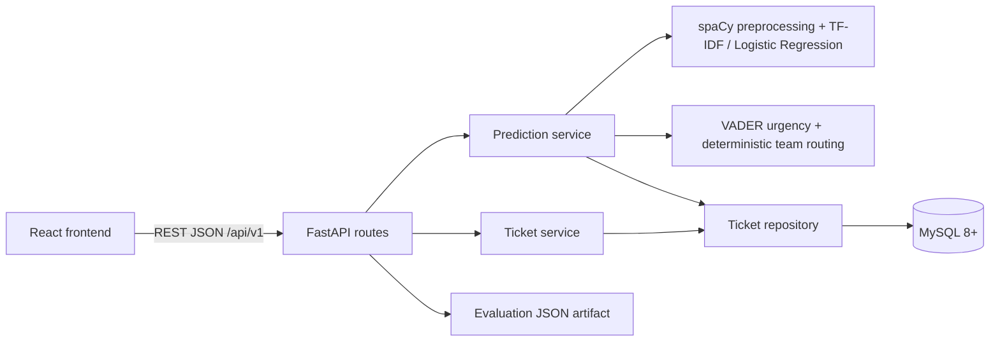
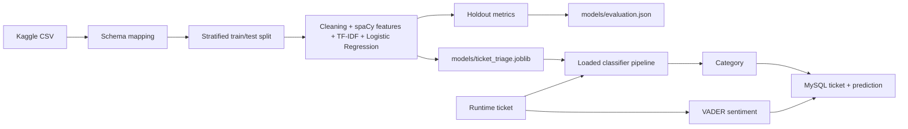

# System Architecture

## Runtime

Routes validate HTTP input and map service errors to status codes. Services orchestrate inference and ticket-read use cases. Repositories own SQLAlchemy queries and the ticket/prediction transaction. SQLAlchemy models and Pydantic response schemas remain separate.

## Training and Inference

The CSV trains/evaluates the category pipeline and is never bulk-loaded into MySQL. MySQL contains application-created runtime tickets and their prediction history. The model artifact remains on disk, not in the database. Evaluation metrics are read from the training JSON and never recomputed from runtime tickets.

## Design Notes

- Existing `/predict`, `/tickets`, `/statistics`, and related paths remain compatibility aliases; `/api/v1` is the documented contract.
- Category routing is deterministic and intentionally separate from the classifier.
- MySQL is required at runtime; SQLite is used only in isolated tests.
- Development startup applies Alembic migrations. Non-development environments require an explicit migration step.
