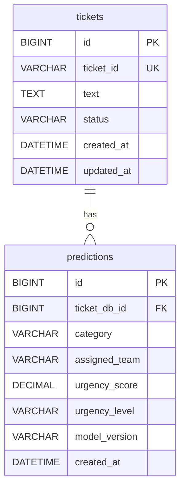

# Database Schema

The runtime database is `support_ticket_triage`. Alembic revision `0001_initial` creates `tickets` and `predictions`; each prediction is a historical child record, allowing later model runs to retain prior results.

`tickets.id` is the MySQL-generated internal primary key and foreign-key target. `tickets.ticket_id` is a unique generated public identifier returned to clients; it is not used as the relational primary key. Prediction uniqueness is intentionally not constrained because one ticket may be re-run with a future model.

Indexes support public-ID lookup, recent tickets/predictions, category statistics, and the ticket-to-prediction relationship. Ticket text can contain sensitive information: this coursework database should only contain non-confidential demo inputs.

## Migration Workflow

Create the database once, set `DATABASE_URL`, then run `python -m alembic upgrade head`. Development mode also upgrades on FastAPI startup; `ENVIRONMENT=production` or `testing` does not mutate schema and fails startup if migrations are missing. To generate a revision after changing ORM models, use `python -m alembic revision --autogenerate -m "describe change"`, review it, then apply with `python -m alembic upgrade head`.
